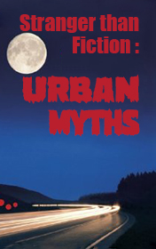

# Stranger than Fiction Urban Myths <kbd>v3.3.1</kbd>

  

## Creator
Phil Healey

## Description

The creators of this collection were just simple guys. They enjoyed collecting and retelling funny local tales. Later they started printing them in the "Guardian" - the famous London newspaper. The stories were quite strange and made the readers laugh. In ten years the authors chose the best tales and published a book "Urban Myths". The book became very popular. Nowadays you can hear these stories on the radio or TV. "Urban Myths" consists of many city stories. Their plot is similar to many stories which are in almost every city on the planet. But it's just a fiction. One can learn one and the same story in different countries. Only the characters will have absolutely various local names.

