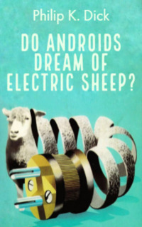

# Do Androids Dream of Electric Sheep? <kbd>v3.3.1</kbd>

  

## Creator
Philip K. Dick

## Description
World War Terminus has destroyed almost every living being on Earth. Now a thick layer of radioactive dust covers the ground. Most people have emigrated to other planets. Rick Deckard cannot leave Earth. He still has some unfinished business here. Rick is an android killer. Androids are robots that were created to help people. But some of them got out of control and escaped. It is due to Rick to find and kill them. He can earn one thousand dollars for each killed android. Rick needs much money to buy a real animal. Now he owns only an electric sheep. But every human must have a real animal. However, killing new generation of androids 'Nexus 6' is not so simple as it may seem... The film adaptation of the novel was named 'Blade Runner' and recognized by scientists as the best science fiction film in history.
