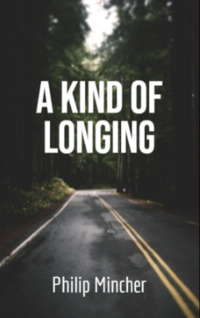

# A Kind of Longing <kbd>v3.3.1</kbd>

  

## Creator
Philip Mincher

## Description
Lots of people love travelling. Some of them prefer airplanes, others prefer their own cars. There are people who adore travelling on a motorcycle. It's not so important whether it is a new shiny sports bike or an old powerful Harley. These people are in love with speed and freedom. They are not limited by highways. Sometimes a person is alone in such a journey, sometimes he travels with a group of like-minded people. Such roads are dangerous for a lonely biker. Lots of things can happen. That time Roy rode alone. The evening was coming; it was getting colder. The man understood that he would be able to drive a few more hours before darkness. Driving along the road, Roy saw several men on the side of the road. They were standing near the car and drinking beer from cans. The men had a weapon.
