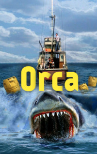

# Orca <kbd>v3.2.1</kbd>

  

## Creator
Phillip Burrows

## Description
Does the sea frighten you? You are on a small boat and there is only water for many kilometres around. Your boat may be fast enough, but it looks not too safe and reliable. But it is the only protection from water and what is under it. Tonya, her husband Jack and their friends  Max and Sasha are rich and successful. They do not work. They want only entertainment. Now the young people are bored. They decide to sail from England to Australia by boat. Finally some exciting adventures begin. Is there any problem? Take a course, admire the beautiful sunsets and catch fish for meals. Such life is more interesting. But what if there is a killer whale deep in the water? It can be dangerous. Does the boat seem so reliable now?  
