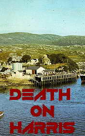

# Death on Harris <kbd>v3.2.1</kbd>

  

## Creator
R. E. Syme

## Description

Angus Flemming came back home because his mother asked him. He hardly ever visited her, though she had never complained. His elder brother and sister often visit their mother. That's why Angus felt guilty. Angus is the youngest child in his family. He used to get away with anything. He lives in Edinburgh now. Angus is a writer who is famous for his crime stories. His girlfriend Susi and best friend Ross are both police officers. They overcame some criminal adventure that changed Angus a lot. (You can read about it in the previous story about Angus "Death in Edinburg"). There, in Tarbet on Harris, the writer remembered his childhood, the school years and his friends. The town hadn't changed at all. But his friends left it looking for better life. Everybody, except Stuart – his schoolmate. Stuart's father died the day before Angus arrived. The writer decided to support his friend in such hard times. 

