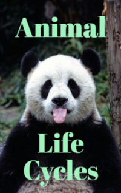

# Animal Life Cycles <kbd>v3.3.1</kbd>

  

## Creator
Rachel Bladon

## Description
There are a big number of different types of animals on the planet Earth. There are real big ones like blue whales, elephants or polar bears. There are also so small species that the human eye cannot see them. Their life cycles vary. All living organisms are divided into groups. Most of the animals in the world are invertebrates. There are very few animals with spinal column, but they are much larger in size and people are used to seeing them around. In the life of a wild animal there are many dangers: predators, lack of food and water. Survival is quite difficult. Another terrible enemy of animals is people. They hunt not only for food, but also for entertainment. They cut down the forests that are home for many species. People even poison water and environment.
