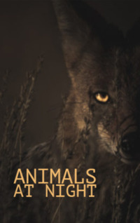

# Animals at Night <kbd>v3.3.1</kbd>

  

## Creator
Rachel Bladon

## Description
At night when people go to bed - many small and large animals leave their cozy burrows and go hunting. They begin their active animal life. Many of them can hunt all night and rest during the day. They clearly see in the darkness, no worse than in daylight. After sunset it gets much colder. This is an active period for such animals as possums. These are completely nocturnal beasts. At night, they begin to look for food - plants, insects and small animals. There are other animals that can be active day and night, depending on their needs - like tigers. And the rabbits leave the holes early in the morning and at sunset, when part of the predators have not woken up yet, and some have already gone to sleep. This is a good way to be safe as long as possible.
