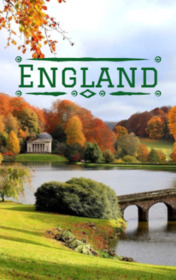

# England <kbd>v3.2.1</kbd>

  

## Creator
Rachel Bladon

## Description
England is a small island country. What do most people thing about it? The River Thames, oatmeal for breakfast, prim gentlemen and the famous detective Sherlock Holmes? In fact, the country has a rich history and culture. This country is the birthplace of the most famous musicians in the world: The Beatles and the Rolling Stones. This country also donated to the world Sir John Tolkien - the writer who founded the fantasy genre. Orcs, hobbits and elves in their present form - this man came up with all these ideas. England is a multicultural country; people speak many languages there. Walking through a small town in the English outback you can meet a representative of each nation on Earth. Also there was one thing invented, which humanity uses every day - shoelaces.
