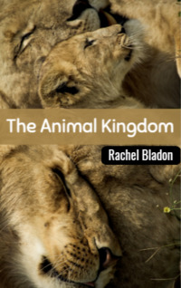

# The Animal Kingdom <kbd>v3.2.1</kbd>

  

## Creator
Rachel Bladon

## Description
Imagine a hot rainforest. Birds sing, small monkeys scream sitting on the tree branches. There are hundreds of brightly colored butterflies in the air around you. There are hundreds of species of insects in the grass. You cannot even see all of them. These creatures are parts of the animal kingdom. This is the most amazing and numerous group of creatures on our planet. There are millions of different kinds of living things in the world. Some are very small, even less than a millimeter. Others are large, like blue whales. A blue whale can grow up to thirty meters in length. Some living beings live only a few days. Others live for more than a hundred years. Animals on our planet look more unusual than creatures from a science fiction novel. You just need to study them. Then you will discover a new world for yourself. 
