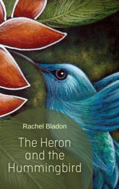

# The Heron and the Hummingbird <kbd>v3.2.1</kbd>

  

## Creator
Rachel Bladon

## Description
The heron and the hummingbird are close friends. But they are very different. Heron is big and slow. Hummingbird is small and fast. The birds live near a big lake. They like eating fish from the lake. One day Hummingbird decides that there aren't enough fish for them. He has an idea. Hummingbird offers Heron to have a race. The two birds have to fly to the old tree near the river. The one who gets faster will win. The winner will have all the fish in the lake. And the loser will never eat it again. Heron knows that Hummingbird flies much faster than him. But he is a kind bird and agrees to take part in the race. Hummingbird is sure he will be the winner. But is his extraordinary speed enough to win the race? 
