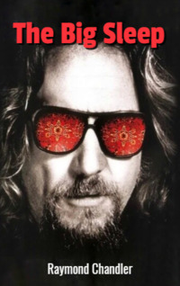

# The Big Sleep <kbd>v3.2.1</kbd>

  

## Creator
Raymond Chandler

## Description
Two movies, based on the plot of this novel, were released. One of them is a cult movie 'The Big Lebowski'. 'The Big Sleep' is about a private investigator Philip Marlowe. This is the first book about the adventures of this man. Nowadays the novel is a classic detective story. It is still at the top of the best detective novels of all time. Everything happens in Los Angeles. Philip is hired by a military general. The general is a widower. He lives with two daughters. One daughter is a drug addict. Her name is Carmen. The second daughter Vivian is the wife of the famous gangster. The general asks Philip to deal with the blackmailer who is threatening one of his daughters. So the detective gets to work. 
