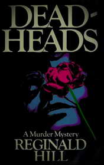

# Deadheads <kbd>v3.3.1</kbd>

  

## Creator
Reginald Hill

## Description
This is an unusual detective novel. You won't be able to predict the end of it. There are a lot of unsolved crime mysteries and much British humor. Patrick Aldermann is in the center of this story. Many deaths regularly occur around him. People die every day. But when these deaths play right into someone's hand, it becomes very suspicious. When Patrick's aunt passes away in the rose garden, he inherits her big mansion. When the man comes to work for a new company, he has a great career development. It is not because he is a good specialist. The reason is many people die and Patrick takes their positions. Patrick's boss starts fearing for his life. So he goes to the inspectors Dalziel and Pascoe. The police become interested in this case.
