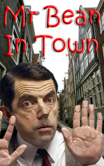

# Mr Bean in Town <kbd>v3.3.1</kbd>

  

## Creator
Richard Curtis

## Description
Mr. Bean decided to go to the restaurant on his Birthday, because he wanted to enjoy his celebration. But to be at the restaurants was unusual situation for him. And our hero demonstrated his strange behavior there. People didn’t understand him. He hadn’t enough money for the order, so he choosed  "steak tartare". He didn’t like this food and big plate for food had bad impression on him. Mr. Bean didn’t know what to do with it. And had found a great decision to hide the meat in things surrounding him. He considered himself very smart in this situation. Than he showed to waiter this dirty place and manager took him a new table and he had a new embarrassing position... Later our hero had to clean his dress and went to the to the launderette. In the launderette he has found a new adventures...
