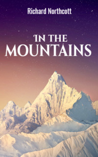

# In the mountains <kbd>v3.3.1</kbd>

  

## Creator
Richard Northcott

## Description
There are many types of mountains on Earth. Some of them are covered with thick green forests while the tops of others are covered with ice and snow. It is very cold there. There are some dry and hot mountains. Many rivers begin high in the mountains. This is an amazing part of nature. In fact, the mountains appear even today.  These are parts of the crust that change shape due to volcanic eruptions, earthquakes or tectonic plate movements deep underground. Life in the mountains can be pretty hard, but people live there. The main point is there are no good roads, shops or hospitals. People have to ride animals or on foot, as cars cannot drive everywhere. At high altitude, the air is thin, and you have to get used to it. Are there mountains in the area where you live?
