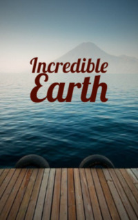

# Incredible Earth <kbd>v3.3.1</kbd>

  

## Creator
Richard Northcott

## Description
In many ways, the planet Earth resembles an orange. They have a similar shape. The planet also, like this fruit, has its own skin - the earth's crust. There are holes in the earth's crust - volcanoes. When they erupt, stone, ash, and hot lava fly out. Thanks to volcanoes, new islands sometimes arise at the planet. Two thirds of the land are covered by water. Basically it is the salty water of the oceans and seas that cannot be drunk. But there are also rivers with fresh water, thanks to which trees grow and animals survive. Rivers usually start in the mountains. They gather from snow or rain and begin to flow below. Rivers form waterfalls. The largest and most beautiful of them are favorite places of tourists even today. Fresh water is very important for life on the planet.
