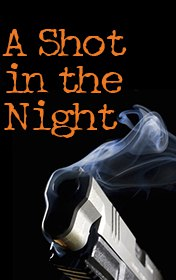

# A Shot in the Night <kbd>v3.2.1</kbd>

  

## Creator
Ridley Andrew

## Description

A father and his daughter are going to rest in a farm, far away from a loud city. The father is a detective inspector Rush. But he introduced himself as a bank employee to the housekeepers. The behavior of the house owners seemed quite strange to the policeman, but his daughter just wanted to have a nice holiday. There were no guests, except them. But everything was pointing, that many people lived at this farm. One day a strange silent man came to the farm. That night inspector Rush woke up. He heard the sound of the gun. The housekeeper assured him that there were some poachers near the farm. Next morning the mysterious guest disappeared. The inspector’s daughter found blood in the yard. So the suspicions weren’t groundless.

