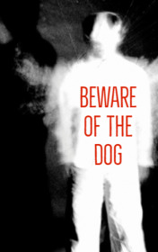

# Beware of the Dog <kbd>v3.2.1</kbd>

  

## Creator
Roald Dahl

## Description
The protagonist of this book was sitting in the cockpit. Below him there were dense white clouds. He was firmly holding the steering wheel, the plane flying smoothly. He told himself that everything was fine. A little more time - and he would fly to the house. He was definitely able to do it. He would land the plane and ask for help out, because he had no leg. Everyone would think that this was such a joke, but this was true. The pilot looked below: the floor was covered with blood, and he had nothing below the knee. The bullets tore off part of the right leg, but there was no pain. He felt fine, was awake and was not going to faint. But gradually the pilot started to weaken. Holding his head was getting harder, and it fell on the chest. The plane was flying at the height of seven kilometers and it was not the best moment for passing out.
