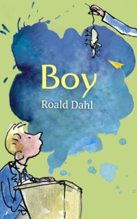

# Boy <kbd>v3.2.1</kbd>

  

## Creator
Roald Dahl

## Description
Roald Dahl was a successful British writer. Today he is best known for his fascinating stories about kids. The main character of this book is also a child. This child is Roald Dahl himself. The writer tells us his most vivid childhood memories. They are funny, silly and sometimes sad. But they are never boring.  The writer remembers his family and their life together. He describes difficult times at school and his fear of the school headmaster. He tells us how he got in trouble for playing tricks on the people he didn't like. He happily recalls summer holidays in Norway and testing out chocolates for a famous company. Without a doubt, Roald Dahl had a great childhood. No wonder it inspired many of his books. 
