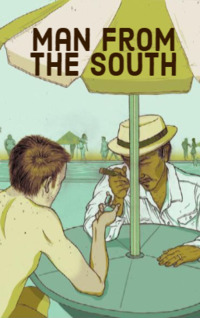

# Man from the South <kbd>v3.2.1</kbd>

  

## Creator
Roald Dahl

## Description
It was in the evening. The main character of the book wanted to buy some beer and sit near the pool in the garden. To meet the sunset there was especially nice. He bought beer in the bar and wandered around the garden for a bit. This was a beautiful place. There were many comfortable tables and large bright umbrellas above them. At the tables there were people in bathing suits, and children were splashing merrily in the pool. The man sat at one of the tables under a yellow umbrella and poured himself some cold beer. An old man in a suit and a hat was passing by. He was short, but dressed neatly. He asked if he could sit at this table and the man allowed it. The old man turned out to be an interesting person. They talked about the other guests of the hotel, and after a while young American sailor joined this company.
