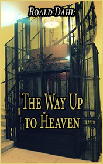

# The Way up to Heaven <kbd>v3.3.1</kbd>

  

## Creator
Roald Dahl

## Description
Mrs. Foster was terrified of any delay. Either it was being late for a plane, a ship, a train or simply a curtain in a theater rising before she came to the auditorium. In all other matters, she was a calm and sensible woman, but as soon as she began to realize that she was late, she panicked and her eye started twitching. It was really weird. For some people, the simplest actions could turn into a real obsession, and Mrs. Foster was one of those people. The woman left the house half an hour earlier than needed to go the train station. She took the hat, the umbrella and the gloves. This was much better than sitting in a room and being nervous. But for Mr. Foster, his wife's behavior was annoying and he could not understand her.
