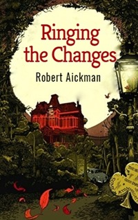

# Ringing the Changes <kbd>v3.2.1</kbd>

  

## Creator
Robert Aickman

## Description
This writer is known for many good horror stories. But 'Ringing the Changes' is considered the most popular of them all. Perhaps it is because it was included on the largest number of collections from all the author's stories. This story is fascinating and truly scary. There are ancient frightening creatures, ordeals for heroes, something that is beyond human understanding. It shows how the ancient world collides with the modern. Everything starts as usual. A young married couple is spending their honeymoon in a small cozy town. It is a resort town. Only one thing is strange. Church bells sound here too often. It you want to read the perfect story about evil dead, this is the right book for you. 
