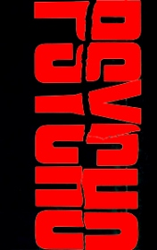

# Psycho <kbd>v3.2.1</kbd>

  

## Creator
Robert Bloch

## Description
The young woman Marion Crane has stolen 40 thousand dollars, which she was entrusted by her chief. She didn't plane this crime, the theft was happened spontaneously. Marion just wanted to get out from town and started a new life with her lover. During the flight, tired of the stress and driving, she decided to turn off the highway and spent the night in a secluded motel, where the police wouldn't find her in any way. This motel was run by a young guy Norman Bates who lived nearby with his mother. Norman immediately has felt in love with Marion, but his mother was against this girl. After this meeting and talking with such unusual man, Marion decided to return the money and continue to live the previous life, but suddenly her plans were destroyed by the hotel's manager mother.
