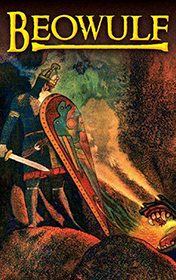

# Beowulf <kbd>v3.3.1</kbd>

  

## Creator
Robert Hill

## Description
This is an ancient epic poem, which was written at the end of the seventh century. The text first saw the world in 1815. This is a rare case when the text written in pre-Christian times has survived until the present time. A horrible monster named Grendel has pursued King Hrodgar for over 12 years. The monster kills his strongest and bravest warriors. Beowulf decides to help the king and gathers his warriors for a significant battle. He is a famous warlord and he is able to defeat any beast. Beowulf kills Grendel in a one-on-one battle. But Grendel's mother rises from the sea bottom to punish the killer of her son. Beowulf battles her in a den under the water. In the second part of the text, Beowulf himself becomes king. He fights a dragon and is badly wounded. The hero dies after living a decent life. This is an honorable end for any warrior.
