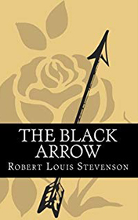

# The Black Arrow <kbd>v3.2.1</kbd>

  

## Creator
Robert Louis Stevenson

## Description
The story takes place in medieval England. It was the period of the reign of King Henry the Fourth and the widely known bloody war between the Red and the White Roses. Richard Shelton is the main character of the story. He is the son of a famous English knight. The young man will have to face numerous ordeals. A messenger arrives in the village, which is owned by Sir Burkeley. He brings an urgent order for all men to go on the march immediately. At this time, a black arrow flies into the castle with a note in which a famous rogue tells, that he wans to kill Sir Burkeley. This is where the story begins. This is classic chivalrous prose at its best. This is a tale of sword battles, revenge for fathers and battles for restoring honor.
