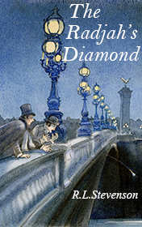

# The Rajah’s Diamond <kbd>v3.2.1</kbd>

  

## Creator
Robert Louis Stevenson

## Description

Sir Thomas started his career in India. He did some secret favor for Rajar of Kashgar. In acknowledgment Rajah presented Thomas a valuable thing - his famous diamond. In his homeland this English soldier became one of the most richest and famous people. After returning to England he married to a rich and noble woman. Harry Hartley was a sixteen-year-old orphan and worked as a private secretary for Sir Thomas. This work was no pleasure. His master was a difficult person. He always shouted and was angry with Harry. Unlike Sir Thomas his wife Lady Vandeleur was kind and friendly. The young servant often carried out many different private errands for her. Unfortunately, the next errand led Harry to the bad consequences. 

