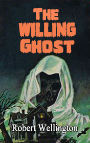

# The Willing Ghost <kbd>v3.3.1</kbd>

  

## Creator
Robert Wellington

## Description

A young woman came to the office of a private detective. He recognized her almost immediately. She was an heiress of one of the richest people in England. Her photos were almost in all newspapers. He father died a year ago. Everything he owned he bequeathed to her, including a big old house. It was built in the second half of the 17th century. Its age was over three hundred years old. Actually, the house was the reason to contact the investigator. The client was sure there were ghosts in it. It started three months ago. Every midnight a strange noise happened in the house. As soon as the property owner started looking for the reason, the noise stopped. The woman looked exhausted due to the lack of regular sleep and fear. The detective promised to investigate this case. The noise turned out to be not of the some supernatural origin. It was something more real and unexpected.

