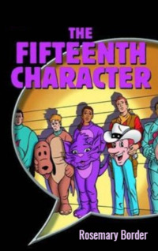

# The Fifteenth Character <kbd>v3.3.1</kbd>

  

## Creator
Rosemary Border

## Description
Sally Brown is an ordinary student. During the holidays, she works at Happy Hills, a local amusement park. This is a very popular place among visitors. Every day lots of people come here to ride and look at the staff in the costumes of various funny characters. This day is very unusual. Zapp is a famous singer among young people. He arrives in this amusement park. Zapp has to open a new attraction. This is a wonderful possibility for Sally. The girl wants to talk to her favourite singer, despite the displeasure of her boss. He is sure that she already works too little. But an unexpected trouble happens - Zapp's disc with the new secret song disappears. Happy Hills is not a very happy place anymore. 
