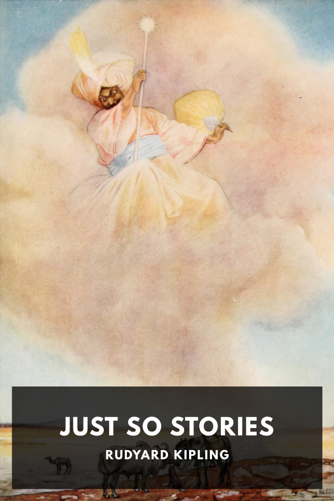

# Just So Stories <kbd>v3.2.1</kbd>

  

## Creator
Rudyard Kipling

## Description
A collection of short humorous fables for children, most purporting to tell the origin of animal characteristics such as the camel’s hump.
