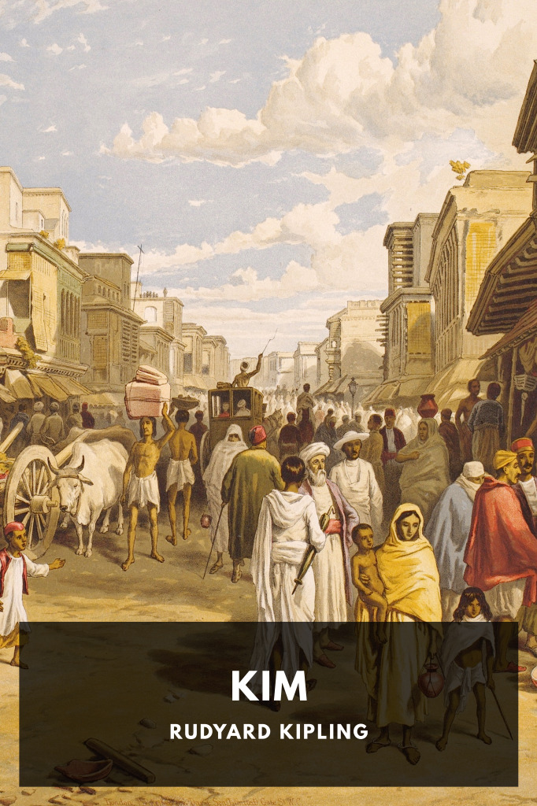

# Kim <kbd>v3.2.1</kbd>

  

## Creator
Rudyard Kipling

## Description
An orphaned street-urchin follows a holy man across India during the time of the British Raj, eventually gaining an education and becoming a recruit to the Great Game of espionage against the Russians.
