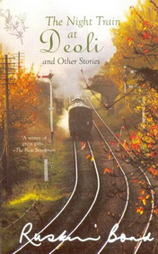

# The Night Train at Deoli <kbd>v3.2.1</kbd>

  

## Creator
Ruskin Bond

## Description
Ruskin Bond is rightly considered to be one of the greatest Indian writers in modern times. The author works in different genres but all his books have one thing in common: they are written from the heart. Bond keeps his stories simple and touching at the same time. Most of his books are inspired by real life experience and have a deep philosophical meaning. 'The Night Train at Deoli' is no exception. It portrays how one event, memory or dream can truly change life. The story is told from the point of view of a young college student who visits his grandmother during summer holidays. The train passes through a small local station in the jungle. The boy always feels intrigued by this lonely place. One day he meets a girl there who will affect his life in an unexpected way.
