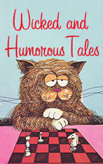

# Wicked and Humorous Tales <kbd>v3.3.1</kbd>

  

## Creator
Saki Saki

## Description

This is a collection of six incredible stories from the master of sarcasm Hector Hugh Munro, who is more famous as Saki. You may not know that he chose this pen-name after the monkeys, which lived in South America. They have a very calm and delicate character until you dare them. Hector was a shy and clever man. His stories are full of a subtle irony and sarcasm. The book starts from the story "The opened window". A young man comes to his sister to the countryside, where he wants to improve his health. He goes to his neighbors and gets into a strange situation. The next story tells us about three kids, who gave a good lesson to their neighbor farmer. The farmer had killed their cat. Further you will meet two children, who composed a horrible story about a doll, etc.

