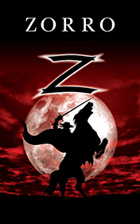

# Zorro <kbd>v3.2.1</kbd>

  

## Creator
Sally M. Stockton

## Description

Zorro is a popular super hero from Spanish California. He was a foxy and clever revenger, who fought for justice. He wore a mask and a hat, was dressed in black clothes, and was armed with a sword and a whip. Zorro travelled by a black horse and wherever he was, he left a mark by three hits of the sword. Of course, his friends were honest poor natives, and his enemies were dishonest rich men. Sergeant Pedro Gonzales and his soldiers considered Zorro as a criminal and a bandit and wanted to catch him. Once at the February stormy night, the soldiers sat in a tavern and Sergeant Pedro talked to Don Diego that he could easily kill a terrorist Zorro in a fight. When Don Diego went home, Zorro came into the tavern and gave a chance to Sergeant to show that his words cost something.

