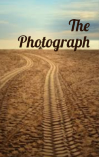

# The Photograph <kbd>v3.2.1</kbd>

  

## Creator
Sefi Atta

## Description
In the modern world, photos surround us constantly. We can see them in newspapers, on television and on any website on the Internet. Magazines about fashion and movies are filled with photos of famous actors and models. Athletes and politicians look at us from the pages of newspapers. People say that it is better to see something once than to hear about it. But sometimes the picture can fool us. Imagine a thin sad girl. Around the dust, you see trucks with food going behind her. Soon they will leave the village and there will be only many footprints on the ground. In the village there are many photographers from other countries. One of them kneels to photograph the girl. Later he will return home and receive many awards for this photo. But they will no longer please him, as he saw real starvation.
