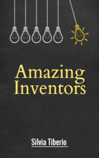

# Amazing Inventors <kbd>v3.3.1</kbd>

  

## Creator
SilviaTiberio

## Description
Humanity is developing faster and faster. Technology does not stand still. But among millions of people, a few are always great. Those men who made the greatest discoveries of their time. Those men who changed the life of the entire planet. The stories of such people are in this book. Johannes Gutenberg invented the printing press. Louis Braille invented the typeface for the blind. It is still used today. Alexander Graham Bell designed the world's first telephone. Thomas Edison gave the world a light bulb. Thanks to Guglielmo Marconi we have wireless data transmission. John Logie Baird invented the first television. Now it is difficult to imagine our life without all these devices. Learn more about how the familiar modern world was created. 
