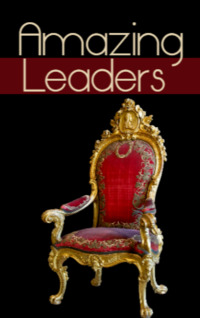

# Amazing Leaders <kbd>v3.2.1</kbd>

  

## Creator
SilviaTiberio

## Description
Humanity has always been prone to wars and raids on neighbouring countries. Nobody ever wanted to sit still and live peacefully. But in every situation, humanity needed leaders. These leaders were the reason for global events in each era. William the Conqueror was the first Norman king of England. Saladin was the first Muslim leader who seriously opposed the crusaders. Genghis Khan was the leader of the Mongol Empire. Catherine the Great was the woman who turned Russia into a very strong empire. Abraham Lincoln was the legendary president who ended slavery in America. Queen Victoria is the woman who gave her name to an entire era. Learn more about the rulers who changed the life of mankind. 
