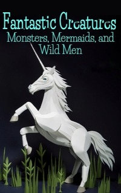

# Fantastic Creatures Monsters, Mermaids, and Wild Men <kbd>v3.3.1</kbd>

  

## Creator
Simon Beaver

## Description
Around the world, people love to tell stories. Even before the first printed books and long before poems, people were telling stories. They were sitting by the fire in the cave and making up something new. They imagined many fantastic creatures. Such stories are older than many ancient historical documents. This book is a collection of classic fairy tales. These interesting stories are about creatures that hide and live among people. Learn more about dragons, hydras, yetis and other mythological creatures. Do they live in the real world? This question has no answers. Many try to find the key to this mystery. Reading this book, you understand what people felt thousands years ago, listening to these tales.   
