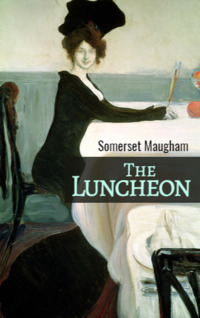

# The Luncheon <kbd>v3.3.1</kbd>

  

## Creator
Somerset Maugham

## Description
This story is about a wealthy and successful writer who recalls his past. Back then, everyone went through hungry years. He was no exception. Many years ago the writer used to live in Paris. His modest earnings let him only pay for a small apartment and not to die from hunger. Once a young man received a letter from a fan - she offered to meet. But she had very little free time. So the woman wanted to have breakfast together before her departure from the city. She suggested to meet in one expensive restaurant. Mostly rich people and politicians would dine there. The writer understood that all his savings were not enough. But young men are rarely able to refuse a woman. Only experience can teach this. 
