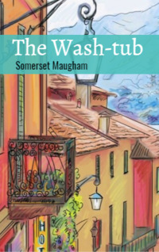

# The Wash-tub <kbd>v3.2.1</kbd>

  

## Creator
Somerset Maugham

## Description
This town is located on a steep hillside. From afar, it looks like dozens of small houses scattered in random order on the ground. These roofs have lost their original color after many years in the hot sun. One cannot take in all the sights in one glance. The town streets rise the mountain in zigzags and look like snakes. On the streets one can see many shabby houses in the Baroque style, where the local nobility lived many years ago. This place is very beautiful. In winter several small hotels are always crowded with painters. They come not to relax, but to depict the city on their canvases. All of them work hard. Someone paints in the style of realism, the other tries to express himself on strange avant-garde canvases. It goes on every year. 
