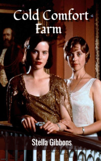

# Cold Comfort Farm <kbd>v3.3.1</kbd>

  

## Creator
Stella Gibbons

## Description
Some critics call this novel one of the funniest in the history of literature. It is a classic of the nineteenth century English literature and also a brilliant parody of the most popular novels of that time. A wonderful collection of ridiculous, colorful and memorable characters does not leave readers indifferent. The main character is in the midst of all these people. Flora is nineteen. Having lost her parents, she decides to go to a farm in Sussex and live with her relatives. A big family living on this farm suffers from the tyranny of an old woman - Aunt Ada Doom. She rules the whole life of the household. Nothing happens without her knowledge. Aunt Ada controls everyone despite the fact she constantly sits in her room, behind the locked door. The plot contains references to many famous classics.
