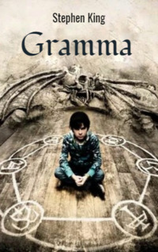

# Gramma <kbd>v3.3.1</kbd>

  

## Creator
Stephen King

## Description
'Gramma' is a mystical story by Stephen King. In 2014 the film 'Mercy' based on the plot of this story was released. The eleven-year-old boy George is alone in the house. He has to look after his old grandmother, who does not get out of bed. His mother Ruth took the eldest son Buddy to the hospital. George is afrad of his grandmother. The boy thinks she is crazy. The child learns that his grandmother is a witch. The old woman dies at night. George is scared. The phone does not work and his mother is not at home yet. George decides to cover his grandmother with a blanket. At this moment, the old hand grabs the boy. But he manages to pull it out. The 'dead woman' wants her grandson to come to her. What does she want from him? How to be saved? 
