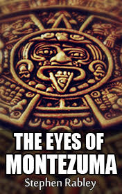

# The Eyes of Montezuma <kbd>v3.2.1</kbd>

  

## Creator
Stephen Rabley

## Description
The vacation of the couple Conwall is coming to the end. They leave rainy England and go back to their homeland - Madrid. They are travelling by the ship. Aboard the ship, the couple gets acquainted with an American student. It is the first time this student has travelled alone and this is the reason she had bought a yellow Fiat. The Conwalls learn some news: the Countess of Montalban died. She was one of the richest women in Spain. Also, she was the owner of the famous earrings 'The eyes of Montezuma'. These earrings had the two biggest diamonds in the country. The jewelry had belonged to her family for 200 years since they were brought from Mexico. Shortly before her death, the countess donated them to the museum. The Conwalls arrive and an unpleasant surprise is expecting them. The American student had disappeared and a now stranger drives her car. Somebody steals the Countess' earrings from the museum.
