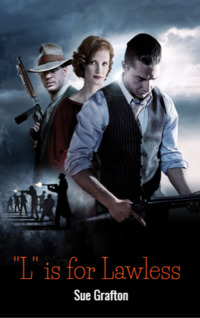

# L is for Lawless <kbd>v3.2.1</kbd>

  

## Creator
Sue Grafton

## Description
Who would have thought that such a banal beginning of the day would bring so many problems. Now Kinsey Millhone has to risk herself and solve many secrets again. No one ever expects something like this. A close friend of Kinsey asks her for help - to arrange the funeral of a military pilot named Johnny Lee. There is nothing suspicious in the request. But why has nobody heard about this mysterious Johnny? Why do the Air Forces even have no records of this man? Why is the pilot's apartment immediately robbed after his death? This whole situation begins to remind of someone else's conspiracy. Global, very mysterious and extremely dangerous. But Kinsey is ready to accept this unexpected challenge. 
