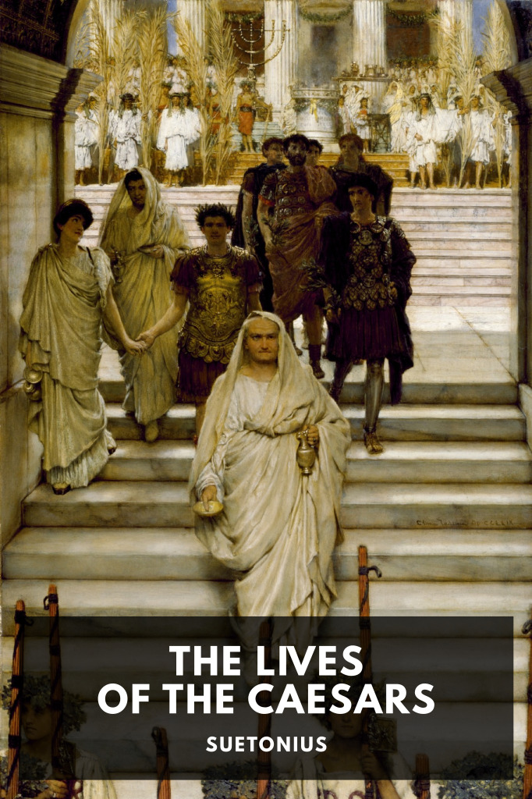

# The Lives of the Caesars <kbd>v3.2.1</kbd>

  

## Creator
Suetonius

## Description
The lives of the twelve emperors called Caesar are described in detail by a near-contemporary Roman historian.
