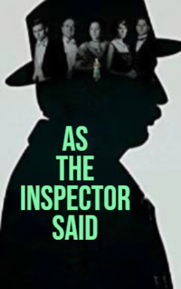

# As the Inspector Said <kbd>v3.3.1</kbd>

  

## Creator
Syril Hare

## Description
Sonya French married Robert, despite the fact that he was older. She did not love her husband. The young woman was bored with that old man. But Robert did not care about that. He was only interested in books and jewelry. Soon Sonya had a lover - Charles Darrell. Some rumors started spreading about this, and Sonya realized that soon Robert would find out. She knew that her old husband would never give her a divorce.  He was very rich. On the contrary Sonya and Charles did not have any money. They decided that killing Robert was a good idea. One police officer accidentally hinted them at this way out when he told them to be careful, because there were a lot of dangerous people around. The lovers figured out how to kill Robert. The plan was simple and fairly obvious, but the young people were not experienced criminals.
