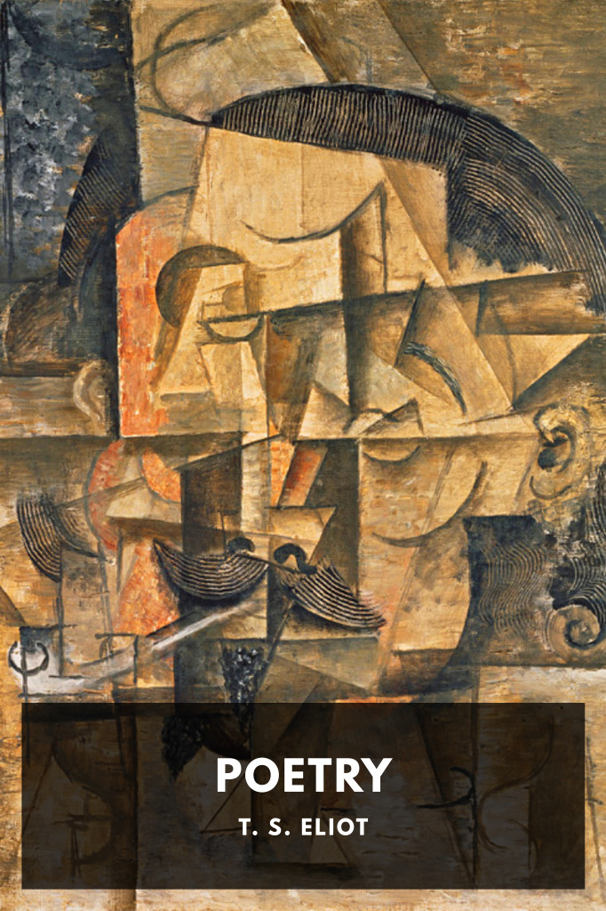

# Poetry <kbd>v3.2.1</kbd>

  

## Creator
T. S. Eliot

## Description
A collection of T. S. Eliot’s poetry, including “The Love Song of J. Alfred Prufrock,” “The Waste Land,” and “The Hollow Men.”
