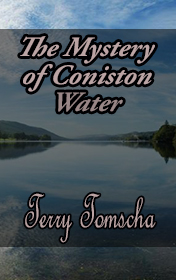

# Mystery of Coniston Water <kbd>v3.3.1</kbd>

  

## Creator
Terry Tomscha

## Description
All mysterious and unexplained always hypnotizes us. We follow the traditions and believe in signs. The book 'Mystery of Coniston Water' tells the readers about a shy and talented girl Julie, who faced the mysterious events at the camp. She was looking forward to a trip to the camp Holly How. Her friend asked her not to go there. The camp had a bad reputation because of the horrible events which happened there several years ago. Julie didn't trust in gossip. She dreamt to make a lot of friends and have fun before school starts. Instead of that, she met an odd girl Anna, who revealed to her, what Lake Coniston Water was hiding. The authors Terry Tomscha and Peggy Albers created a fascinating story. The admirers of mystery will like it. The book contains the adopted text, the dictionary and the exercises for verification comprehension.
