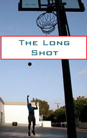

# The Long Shot <kbd>v3.2.1</kbd>

  

## Creator
Terry Tomscha

## Description

Basketball is a meaning of life for a guy named Ricky. He studies at high school. His dream is to play in the school team, which is invincible. All high school students dream to get into the team and it is just the time of selection of the players for the next season. Ricky and his best friend Tony decide to participate in the selection. One day after coming to school, they find a note with a threat in the locker. It states that if the boys get involved, something terrible will happen. The children accept everything as a cruel joke. After school, they check their emails and read two more threatening letters. Despite the threats, the boys still dare to play and win. Next day Ricky and Tony join the basketball team. They are incredibly happy. After the lessons, a car hits Ricky. This is just a beginning. 

