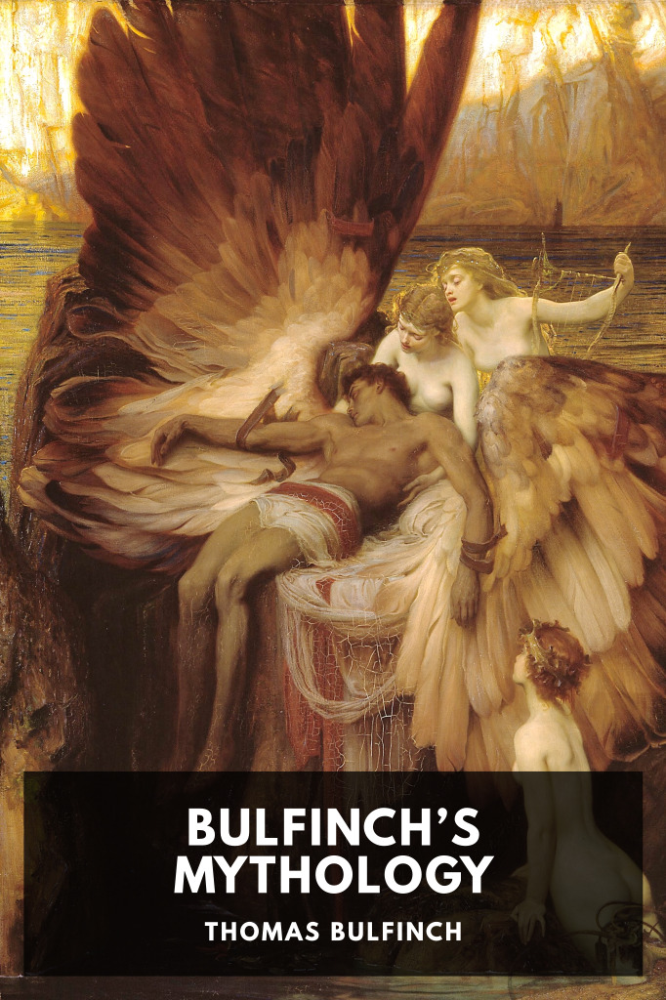

# Bulfinch’s Mythology <kbd>v3.3.1</kbd>

  

## Creator
Thomas Bulfinch

## Description
An American classicist collects and explains myths and legends ranging from those of the ancient Greeks and Romans, through stories of King Arthur, to the legends of Charlemagne.
