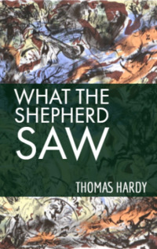

# What the Shepherd Saw <kbd>v3.2.1</kbd>

  

## Creator
Thomas Hardy

## Description
Corrected version 	Everything happened at Christmas, in the south of England. That night a bright white moon was illuminating the earth. Shepherds lived on these lands. They kept sheep and grazed them all year round. They had to be close to the herd all the time. Therefore people used small houses on wheels, where they could have a rest and warm themselves. At the same time, it was possible not to lose sight of the precious sheep. One of the huts stood between low trees. It was not so cold; the wind did not pester so much. The house had small windows through which its inhabitants could watch eight hundred sheep grazing nearby. Also it was easy to see ancient stones, built in the form of a doorway. No one already remembered who created this small monument. The locals called this place the Devil's Door.
