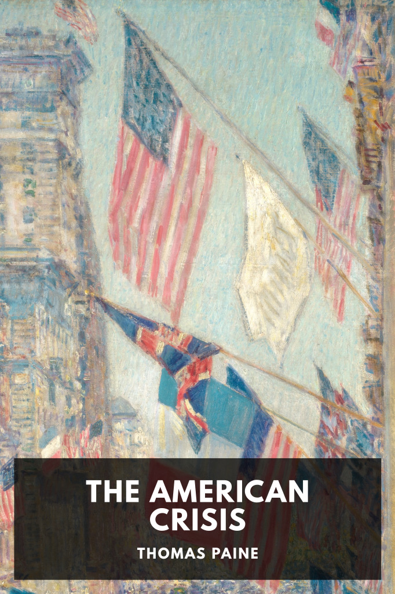

# The American Crisis <kbd>v3.2.1</kbd>

  

## Creator
Thomas Paine

## Description
A collection of articles written during the American Revolutionary War that outline Paine’s support for a self-governing America.
